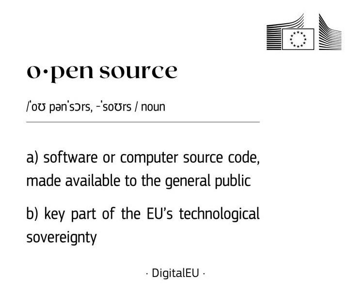

<h1> Hello👋, I'm Dr. Kunal Suri </h1>

<h3> I ❤️ Open-Source and leveraging AI to solve Real-World Software Engineering Challenges </h3>

<h4> Computer Scientist · Manager for European R&D / Innovation Projects at <a href="https://list.cea.fr/en/">CEA</a>, France </h4>

 

 

---

## 👨‍💻 A few lines about me

💪 Spearheading complex cross-functional **European R&D / Innovation projects** funded by the **[European Commission](https://commission.europa.eu/index_en)** from the **[CEA-List](https://list.cea.fr/en/)** side, orchestrating collaborative efforts across multi-faceted teams in EU  

✅ Currently leading the Horizon Europe funded **[RAASCEMAN](https://cordis.europa.eu/project/id/101138782)** project (2024-2027) 

✅ Previously led the EU H2020 funded **[DIMOFAC](https://cordis.europa.eu/project/id/870092)** project (2019-2024)

 

---

## 🌱 Area of interest

📖 AI-Powered Software Engineering  
🛡️ Trustworthiness in Agentic AI Coding Systems  
🤖 Applications of AI in **[Digital Twins](https://en.wikipedia.org/wiki/Digital_twin)** for **[Industry 4.0 / 5.0](https://www.plattform-i40.de/IP/Navigation/EN/Industrie40/WhatIsIndustrie40/what-is-industrie40.html)**

 

---

## 💻 Fav. Tech Stack / Tools

 

---

## 💡 Latest Posts / Ideas on Tech, Innovation, and Society

 

---

## 📊 GitHub Stats

<picture>
  <source media="(prefers-color-scheme: dark)" srcset="https://github-readme-stats.vercel.app/api?username=kunalsuri&show_icons=true&theme=tokyonight&hide_border=true&bg_color=0D1117&title_color=6366F1&icon_color=6366F1&text_color=C9D1D9&count_private=true">
  <source media="(prefers-color-scheme: light)" srcset="https://github-readme-stats.vercel.app/api?username=kunalsuri&show_icons=true&theme=default&hide_border=true&count_private=true">
  
</picture>
&nbsp;
<picture>
  <source media="(prefers-color-scheme: dark)" srcset="https://streak-stats.demolab.com/?user=kunalsuri&theme=tokyonight&hide_border=true&background=0D1117&ring=6366F1&fire=6366F1&currStreakLabel=6366F1">
  <source media="(prefers-color-scheme: light)" srcset="https://streak-stats.demolab.com/?user=kunalsuri&theme=default&hide_border=true">
  
</picture>

 

---

## Articles: EU's Tech & AI Strategy

  
   
  Source: EU Digital & Tech LinkedIn page

 

  
🛡️ 3 June 2026: Strengthening Europe's Tech Sovereignty

   
  
  :eu: Tech sovereignty is Europe’s ability to act independently in the digital world by developing and controlling key technologies, data, and infrastructure, while reducing reliance on non-EU providers. Open source is a key component of this vision, enabling collaboration, transparency, and digital autonomy.
  
  📄 [Read more about EU's Tech Sovereignty](https://digital-strategy.ec.europa.eu/en/policies/eu-tech-sovereignty)
  

 

  
🛡️ 20 March 2024: EU's Guidelines on Responsible AI

   
  
  :eu: The European Research Area Forum has developed comprehensive guidelines for the responsible use of generative AI in research contexts, emphasizing ethical considerations, transparency, and accountability.
  
  📄 [Read the full guidelines](https://research-and-innovation.ec.europa.eu/news/all-research-and-innovation-news/guidelines-responsible-use-generative-ai-research-developed-european-research-area-forum-2024-03-20_en)
  

 

---

*I'm open to interesting conversations and collaboration — feel free to reach out via [LinkedIn](https://www.linkedin.com/in/kunalsuri/)*

